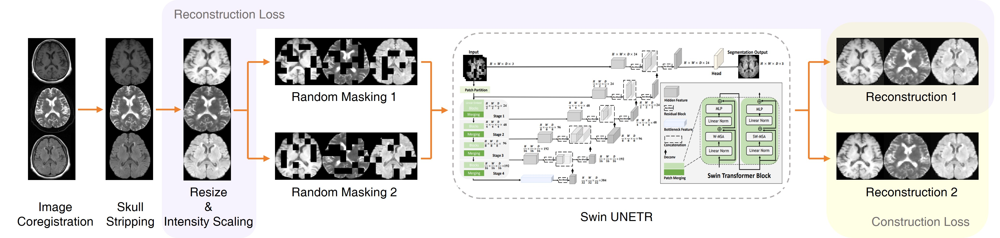

# ImageX — End-to-End Brain Tumor Segmentation on BraTS MRI

An end-to-end deep learning pipeline for brain tumor segmentation on multi-modal BraTS MRI, integrating two state-of-the-art approaches and comparing them on both glioma and metastasis cases.

| Approach | Role in this repo | Best whole-tumor Dice |
|---|---|---|
| **nnU-Net v2** (3D CNN, multi-class) | Inference + per-subregion evaluation | **0.966** (glioma) / 0.49 (metastasis, OOD) |
| **SwinUNETR** (3D transformer, binary) | Full preprocessing + fine-tuning from SSL weights | ~0.58 in 43/150 epochs (improving) |

> Full step-by-step methodology, rationale, and result tables live in [`docs/PIPELINE_DOCUMENTATION.md`](docs/PIPELINE_DOCUMENTATION.md).

The SwinUNETR encoder used here was self-supervised pre-trained on 75,861 plain head MRIs by [MAI-Lab West China Hospital](https://github.com/MAI-Lab-West-China-Hospital/SwinBrain); this repository builds the BraTS preprocessing pipeline, fine-tuning loop, and comparative evaluation on top of those weights.

---

## Where is the code?

```
ImageX/
├── README.md                          ← you are here
├── MODEL_WEIGHTS.md                   ← download instructions for pretrained weights
├── LICENSE                            ← MIT (with third-party attributions)
├── requirements.txt                   ← Python dependencies
├── .gitignore
│
├── notebooks/                         ← entry points: run these top-to-bottom
│   ├── 01_preprocess_swinbrain.ipynb       BraTS → 3-channel volumes for SwinUNETR
│   ├── 02_finetune_swinunetr.ipynb         binary tumor fine-tuning (DiceCE, sliding-window)
│   ├── 03_nnunet_inference_glioma.ipynb    nnU-Net inference + Dice on BraTS2021_00495
│   └── 04_nnunet_inference_metastasis.ipynb  same on BraTS-MET-00086-000 (OOD analysis)
│
├── src/                               ← Python source for non-notebook code
│   ├── segmentation/
│   │   └── ssl_pretrain_ddp.py            SSL pre-training script (multi-GPU DDP, 500 epochs)
│   └── classification/                    secondary downstream task: PD vs PPS
│       ├── models.py                      ViT and Swin classifier heads
│       ├── train.py                       classifier training
│       └── test.py                        multi-model evaluation (ResNet50, DenseNet121, ViT, Swin)
│
├── scripts/                           ← shell entry points for SSL pre-training in Docker
│   ├── run_docker.sh                      launches MONAI Docker container
│   └── run_ssl_pretrain.sh                runs DDP pre-training inside the container
│
├── configs/dataset_split.json         ← 160 / 40 train / val split for SwinUNETR fine-tuning
├── assets/workflow.jpg                ← SSL pre-training workflow diagram
└── docs/                              ← extended documentation
    ├── PIPELINE_DOCUMENTATION.md          full methodology + per-step rationale
    ├── Brain_MRI_Pipeline_Expanded.docx
    └── Bioinformatics_walkthrough.pdf
```

The repository contains **two related but distinct tasks**:
1. **Brain tumor segmentation** on BraTS — the main project (notebooks 01–04).
2. **PD vs PPS classification** — a secondary downstream task that reuses the same SSL encoder, kept under `src/classification/` for completeness.

---

## Quickstart

### 1. Environment
```bash
git clone https://github.com/sivatej800-oss/ImageX.git
cd ImageX
python -m venv .venv && source .venv/bin/activate
pip install -r requirements.txt
```
A CUDA-capable GPU is required for fine-tuning. Inference will run on CPU but slowly.

### 2. Get model weights
See [`MODEL_WEIGHTS.md`](MODEL_WEIGHTS.md) for download links and placement instructions. Weights are not committed to this repository.

### 3. Get BraTS data
Not redistributed here. Request access:
- [BraTS 2021](https://www.synapse.org/#!Synapse:syn25829067/wiki/610863) (glioma)
- [BraTS-MET](https://www.synapse.org/#!Synapse:syn51156910/wiki/) (metastasis)

Then update paths in [`configs/dataset_split.json`](configs/dataset_split.json) (currently set to Google Colab Drive paths used during development).

### 4. Run

| Goal | What to open / run |
|---|---|
| nnU-Net inference on a glioma case | [`notebooks/03_nnunet_inference_glioma.ipynb`](notebooks/03_nnunet_inference_glioma.ipynb) |
| nnU-Net inference on a metastasis case (OOD analysis) | [`notebooks/04_nnunet_inference_metastasis.ipynb`](notebooks/04_nnunet_inference_metastasis.ipynb) |
| Preprocess BraTS for SwinUNETR (skull-strip → crop → register → stack) | [`notebooks/01_preprocess_swinbrain.ipynb`](notebooks/01_preprocess_swinbrain.ipynb) |
| Fine-tune SwinUNETR for binary tumor segmentation | [`notebooks/02_finetune_swinunetr.ipynb`](notebooks/02_finetune_swinunetr.ipynb) |
| Pre-train SwinUNETR from scratch (multi-GPU) | `bash scripts/run_docker.sh` then `bash scripts/run_ssl_pretrain.sh` inside the container |
| Train PD vs PPS classifier | `python src/classification/train.py` |
| Evaluate PD vs PPS classifiers | `python src/classification/test.py` |

---

## Pipeline overview



### Preprocessing — [`notebooks/01_preprocess_swinbrain.ipynb`](notebooks/01_preprocess_swinbrain.ipynb)
1. Skull strip T1 (threshold-based for BraTS; HD-BET for raw scans)
2. Compute brain-mask bounding box on T1 and crop
3. Rigid-register T2w and FLAIR to T1 (SimpleITK, Mattes MI, 4×/2×/1× pyramid)
4. Apply brain mask and same bounding box to T2w / FLAIR
5. Stack into a 3-channel volume `(X, Y, Z, 3)` in T1 / T2w / FLAIR order
6. Crop the ground-truth segmentation with the same box
7. 80 / 20 train / val split → [`configs/dataset_split.json`](configs/dataset_split.json)

### SwinUNETR fine-tuning — [`notebooks/02_finetune_swinunetr.ipynb`](notebooks/02_finetune_swinunetr.ipynb)
- Inputs: 3-channel volumes, label remapping `{1, 2, 3, 4} → 1` (binary tumor)
- Patch sampling: 4 × `128×128×64` random crops per volume, 50 % tumor-centered
- Loss: DiceCE; Optimizer: AdamW (lr = 1e-4, wd = 1e-5); Scheduler: cosine over 150 epochs
- Inference: sliding window `128×128×64`, 4 patches per batch, full volume
- SSL weights loaded with `strict=False` (encoder warm-start; decoder random-init)

### nnU-Net inference — [`notebooks/03_…`](notebooks/03_nnunet_inference_glioma.ipynb) and [`04_…`](notebooks/04_nnunet_inference_metastasis.ipynb)
- Architecture: PlainConvUNet (3D), 6 / 5 encoder / decoder stages, `128×160×112` patches
- 4-channel input (T1, T1ce, T2, FLAIR), 1 mm isotropic, per-channel Z-score normalization
- Sliding-window with test-time augmentation, single fold (or 5-fold ensemble)
- Evaluation: Dice per sub-region (edema / necrotic core / enhancing) + whole tumor

---

## Results

### nnU-Net on BraTS2021_00495 — glioma, in-distribution

| Region | Dice |
|---|---|
| Whole tumor | **0.966** |
| Peritumoral edema (label 1) | 0.974 |
| Necrotic / non-enhancing (label 2) | 0.915 |
| Enhancing tumor (label 4) | 0.948 |

### nnU-Net on BraTS-MET-00086-000 — metastasis, out-of-distribution

| Region | Dice |
|---|---|
| Whole tumor | 0.493 |
| Edema | 0.000 |
| Necrotic | 0.473 |
| Enhancing | 0.000 |

The dramatic drop on metastasis cases motivates the SwinUNETR pipeline: a domain-specific, self-supervised representation paired with binary fine-tuning should be more robust to morphology shifts.

### SwinUNETR binary fine-tuning

| Epoch | Val Dice |
|---|---|
| 1 | ~0.50 |
| 43 | ~0.58 |
| 150 (target) | in progress |

---

## Pipeline comparison

| | nnU-Net pipeline | SwinUNETR pipeline |
|---|---|---|
| Task | 5-class tumor sub-region segmentation | Binary tumor vs background |
| Input channels | 4 (T1, T1ce, T2, FLAIR) | 3 (T1, T2w, FLAIR) |
| Architecture | PlainConvUNet (3D CNN) | SwinUNETR (3D transformer) |
| Pre-training | Supervised on 80K BraTS 2019 samples | Self-supervised on 75K plain head MRIs |
| What this repo runs | Inference + eval | Full preprocess + fine-tune |
| Best whole-tumor Dice | 0.966 (glioma) / 0.49 (metastasis) | ~0.58 (still training) |

---

## Acknowledgments & citations

- **SwinBrain (SSL pre-training, model code, workflow):** MAI-Lab West China Hospital — https://github.com/MAI-Lab-West-China-Hospital/SwinBrain
- **nnU-Net v2:** Isensee et al., *Nature Methods*, 2021 — https://github.com/MIC-DKFZ/nnUNet
- **MONAI:** Project MONAI Consortium — https://monai.io
- **BraTS:** Bakas et al., multi-institutional brain tumor segmentation challenge — https://www.synapse.org/brats

If this repository is useful in your work, please also cite the underlying nnU-Net and SwinUNETR papers.

---

## License

MIT — see [LICENSE](LICENSE). Third-party components retain their own licenses; BraTS data is not redistributed.
